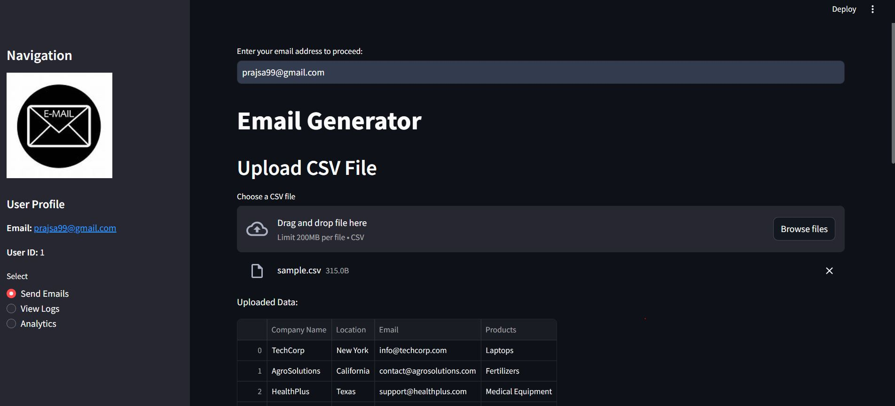
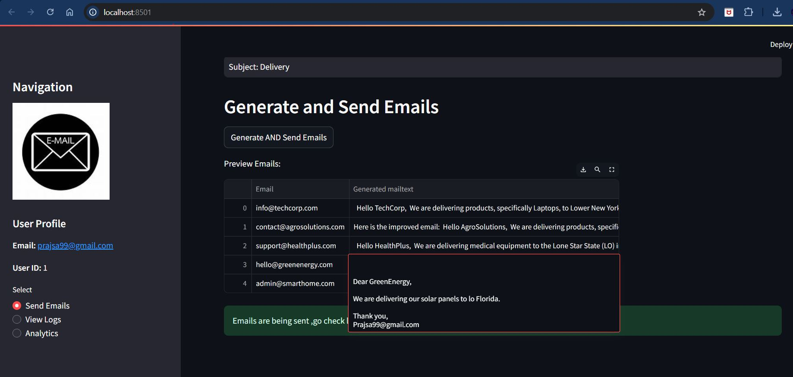
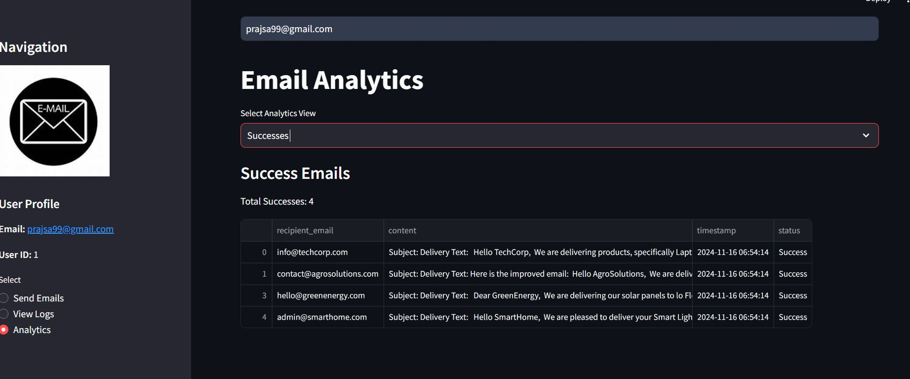

# Custom Email Sender with Analytics

This is a Python-based email automation application built with **Streamlit** for the front-end, **SQLite** for database management, and **Groq's AI service** for generating personalized email content. The app enables users to upload CSV files, create dynamic email templates, send customized emails, view email logs, and analyze email delivery status.

  
  



### Features
- **User **: Users sign in with their email address.
- **Email Template Customization**: Create dynamic email templates with placeholders that are replaced with data from the uploaded CSV file.
- **Email Sending Simulation**: Simulate sending emails with random success/failure statuses.
- **Email Logs**: View logs of sent emails, including timestamps, status (success/fail), and email content.
- **Email Analytics**: View analytics on email performance, such as the total number of emails sent, successes, and failures.
- **Groq AI Integration**: Automatically improve email templates with AI-generated content (e.g., adding a thank-you message).

---

### Requirements
- **Python 3.x**
- **Streamlit**: Web app framework
- **SQLite**: Database for email logs and user management
- **Pandas**: For data manipulation (CSV)
- **Groq API Key**: Required for AI-powered email content improvement

---

### Setup

#### 1. Clone the Repository

```bash
git clone https://github.com/prajwalsable99/Custom-Mail-Sender.git
cd email-automation-app
```

#### 2. Install Required Libraries

Install the necessary Python libraries via pip:

```bash
pip install -r requirements.txt
```

#### 3. Set Up SQLite Database

When you run the app for the first time, the SQLite database will be automatically initialized.

#### 4. Get Groq API Key

To generate personalized email content, you'll need a **Groq API key**:

1. Visit [Groq's website](https://www.groq.ai/).
2. Sign up and obtain your API key.
3. Save your API key in the `config.json` file as follows:

```json
{
    "DATABASE": "email_automation.db",
    "GROQ_API_KEY": "your_groq_api_key_here"
}
```

#### 5. Run the Streamlit App

To start the app, use the following command:

```bash
streamlit run app.py
```

This will launch the app in your default web browser.

---

### File Structure

```bash
.
├── app.py                   # Streamlit app entry point
├── config.json              # Configuration file with database and API key
├── db_setup.py              # Database setup and operations
├── email_utils.py           # Email-related utilities (sending emails, logs)
├── llm_utils.py                  # Groq API interaction for message generation
├── logo.jfif                # Logo for the app
├── outputs/                 # Folder with images ss1.JPG, ss2.JPG, ss3.JPG
│   ├── ss1.JPG
│   ├── ss2.JPG
│   └── ss3.JPG
├── requirements.txt         # List of required libraries for the project
├── README.md                # This README file
└── sample.csv          # Sample CSV file for email generation (optional)
```

---

### Usage

#### User Flow

1. **Enter Email Address**: On the main page, enter your email address to start.
2. **Upload CSV File**: Upload a CSV file with the necessary data to personalize the email (e.g., recipient's name, company, location).
3. **Customize Email Template**: Define placeholders in the email template (e.g., `{Company Name}`).
4. **Generate & Send Emails**: Click **"Generate AND Send Emails"** to process the CSV data and send personalized emails.
5. **View Logs**: Check the logs to see the status of sent emails (success or fail).
6. **Analytics**: View analytics on email performance (total sent, successes, failures).

---

### Email Template Example

Here's an example of an email template:

```plaintext
Hello {Company Name},

We are delivering products {Products} to {Location}. 

Thank you,
{Your Name}
```

This template will be personalized for each row in the uploaded CSV file. For example, `{Company Name}`, `{Products}`, and `{Location}` will be replaced by the corresponding values from the CSV.

---

### Contributions

We welcome contributions to this project! You can:

1. Fork the repository.
2. Create a new branch for your feature.
3. Commit your changes.
4. Open a pull request.

---

### License

This project is licensed under the MIT License.

---

### Acknowledgments

- **Groq** for the AI-powered email content enhancement.
- **Streamlit** for providing the web app framework.
- **SQLite** for the lightweight database solution.

---

